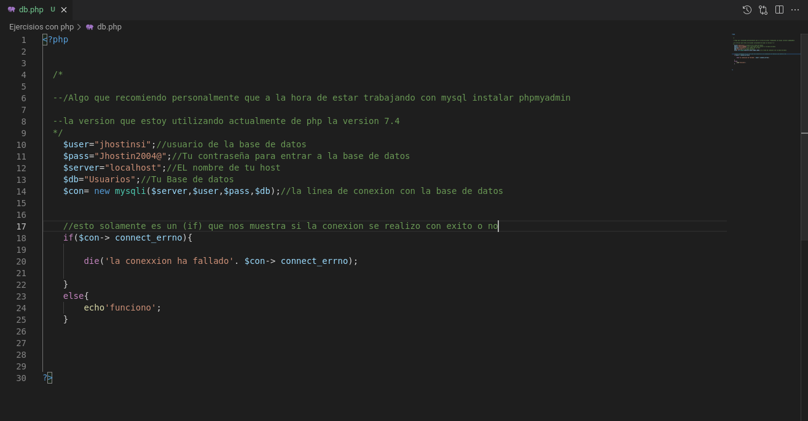

# ¡Carpeta php!

## Bien digamos que esta carpeta esta dedicada solamaente a la programacion con php, aqui encontraras diversos ejercisios y prosedimientos que se pueden llegar a realizar con php. Desde como conectarse a la base de datos, hasta formularios mas conplejos como uno de logeo, o simplemente mostrar datos mysql en una tabla html.
#

### hoja de conexion para poder prosegir con esta parte almenos devemos saber como conectarnos, una de mis recomendaciones es instalar [phpmyadmin](https://noviello.it/es/como-instalar-y-configurar-phpmyadmin-en-debian-9/)

